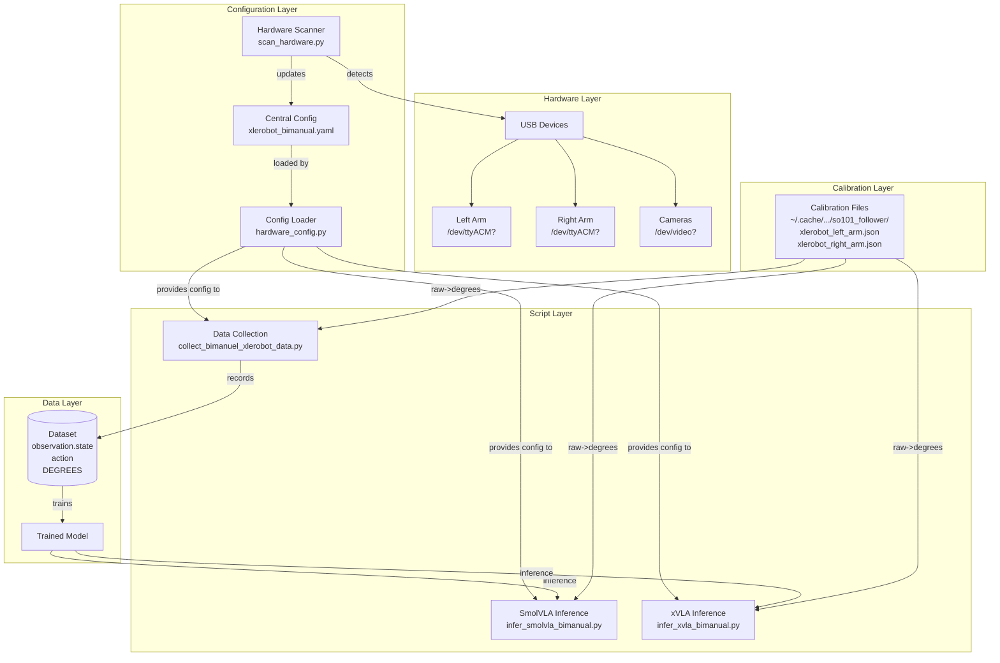
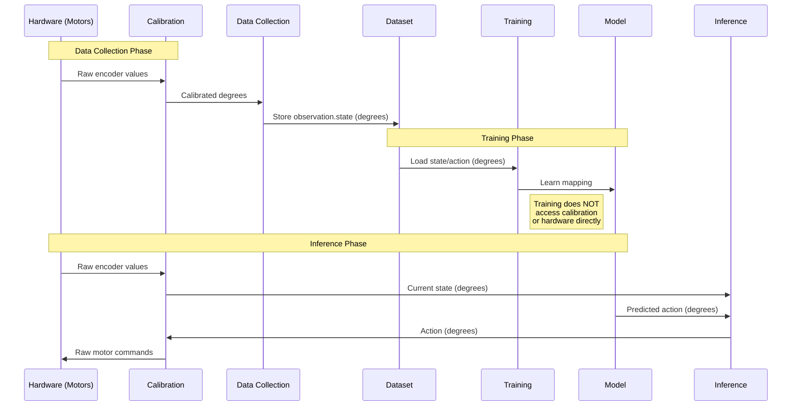

# XLeRobot Hardware Configuration System

## Overview

This document explains the centralized hardware configuration system for XLeRobot bimanual setups. The system ensures consistent hardware settings across all scripts (data collection, training, inference) and provides tools to handle hardware changes (USB port reassignments after reboot/unplug).

## Architecture



## Key Files

| File | Purpose |
|------|---------|
| `jdocs/configs/hardware/xlerobot_bimanual.yaml` | **Single source of truth** for all hardware settings |
| `jdocs/scripts/hardware/scan_hardware.py` | Detects hardware and updates config |
| `jdocs/scripts/hardware/hardware_config.py` | Python module to load config in any script |

## Data Flow: Training vs Inference



## Critical Question: Does Port Change Affect Trained Model?

**NO - The trained model is NOT affected by hardware port changes.**

### Why?

1. **Training uses dataset files** (parquet) containing ALREADY CALIBRATED values in degrees
2. **Calibration was applied DURING DATA COLLECTION**, not during training
3. **Model learns**: `images + state(degrees) → actions(degrees)`
4. **Model doesn't know** about USB ports, raw motor values, or calibration

### What IS Affected?

| Phase | Affected by Port Change? | Why |
|-------|-------------------------|-----|
| **Training** | NO | Uses pre-recorded dataset, no hardware access |
| **Data Collection** | YES | Reads/writes to hardware via ports |
| **Inference** | YES | Reads current state, sends actions via ports |

### The Real Problem: Inference with Swapped Ports

If USB ports are swapped after reboot:

```
Expected:                      Actual (ports swapped):
  Port ACM3 = Left Arm           Port ACM3 = Right Arm (physical)
  Port ACM2 = Right Arm          Port ACM2 = Left Arm (physical)

Model outputs: [left_action, right_action]
Script sends:  ACM3=left_action, ACM2=right_action
Actually goes: RIGHT arm gets left_action, LEFT arm gets right_action

Result: DANGEROUS - wrong arm receives wrong commands!
```

## Calibration File Structure

```
~/.cache/huggingface/lerobot/calibration/robots/
└── so101_follower/                    # Robot type (shared by both arms)
    ├── xlerobot_left_arm.json         # Left arm calibration
    └── xlerobot_right_arm.json        # Right arm calibration
```

### Important: No bi_so101_follower Calibration Directory

The dataset `info.json` shows `robot_type: "bi_so101_follower"`, but calibration files are under `so101_follower/`. **This is correct behavior** because:

1. `BiSO101Follower` internally creates two `SO101Follower` instances
2. Each `SO101Follower` has `name = "so101_follower"`
3. Calibration path is based on `name`, not the parent robot type
4. The `left_arm_id` and `right_arm_id` specify which calibration files to use

## Central Config File Format

```yaml
# jdocs/configs/hardware/xlerobot_bimanual.yaml

robot:
  type: bi_so101_follower
  id: xlerobot_bimanual

  left_arm:
    port: /dev/ttyACM3           # <-- Update this when ports change
    id: xlerobot_left_arm        # Calibration file name
    use_degrees: true

  right_arm:
    port: /dev/ttyACM2           # <-- Update this when ports change
    id: xlerobot_right_arm       # Calibration file name
    use_degrees: true

cameras:
  head:
    index_or_path: 4             # /dev/video4
  left_wrist:
    index_or_path: 8             # /dev/video8
  right_wrist:
    index_or_path: 6             # /dev/video6
```

## Usage: When Hardware Ports Change

### Option A: Interactive Port Identification Script

The most reliable method - physically wiggles each arm to identify ports:

```bash
# Run the identification script
python jdocs/scripts/hardware/identify_ports.py
```

This will:
1. Wiggle each port (ACM0, ACM1, ACM2, ACM3) one by one
2. Ask you which physical arm moved for each port
3. Print results to copy

**Input options:**
- `lf` = Left Follower
- `rf` = Right Follower
- `ll` = Left Leader
- `rl` = Right Leader
- `n` = None/didn't move

### Option B: Using Claude Code

If you're working with Claude Code, simply tell Claude what happened during the identification:

```
User: "I ran identify_ports.py and got:
  /dev/ttyACM0 = Right Follower
  /dev/ttyACM1 = Left Follower
  /dev/ttyACM2 = Left Leader
  /dev/ttyACM3 = Right Leader"

Claude: [Updates jdocs/configs/hardware/xlerobot_bimanual.yaml automatically]
```

Claude will update the config file at `jdocs/configs/hardware/xlerobot_bimanual.yaml` with the correct port mappings.

### Option C: Manual Config Update

Edit `jdocs/configs/hardware/xlerobot_bimanual.yaml` directly:

```yaml
robot:
  left_arm:
    port: /dev/ttyACM1    # <-- Set to your Left Follower port
  right_arm:
    port: /dev/ttyACM0    # <-- Set to your Right Follower port

teleop:
  left_arm:
    port: /dev/ttyACM2    # <-- Set to your Left Leader port
  right_arm:
    port: /dev/ttyACM3    # <-- Set to your Right Leader port
```

### Option D: Hardware Scanner (Less Reliable)

```bash
# Check current hardware status
python jdocs/scripts/hardware/scan_hardware.py

# Test device connectivity
python jdocs/scripts/hardware/scan_hardware.py --test

# Interactive identification (uses wiggle test)
python jdocs/scripts/hardware/scan_hardware.py --identify --update
```

**Note:** The scanner's `--identify` mode may not work reliably if the `pyserial` module is not installed in the current environment.

### Verification

After updating, verify the config:

```bash
# Show current config
python jdocs/scripts/hardware/hardware_config.py

# Or check directly
cat jdocs/configs/hardware/xlerobot_bimanual.yaml | grep -A2 "left_arm:\|right_arm:"
```

### All Scripts Automatically Use Updated Config

No need to edit individual scripts! They all load from the central config.

## How Scripts Load Config

All scripts follow this priority:

1. **Explicit `--hw-config` argument** (if provided)
2. **Central config**: `jdocs/configs/hardware/xlerobot_bimanual.yaml`
3. **Legacy config**: `jdocs/scripts/bimanual/bimanual_so101_hardware.yaml`

```python
# Example: In inference script
def load_hardware_config(config_path=None):
    # Try central config first
    if (PROJECT_ROOT / HARDWARE_CONFIG_CENTRAL).exists():
        return load_yaml(PROJECT_ROOT / HARDWARE_CONFIG_CENTRAL)
    # Fall back to legacy
    return load_yaml(PROJECT_ROOT / HARDWARE_CONFIG_LEGACY)
```

## Troubleshooting

### Symptom: Robot arms move unexpectedly during inference

**Cause**: USB ports are likely swapped from when data was collected.

**Diagnosis**:
```bash
# Check what's connected
python jdocs/scripts/hardware/scan_hardware.py --test

# Compare with config
cat jdocs/configs/hardware/xlerobot_bimanual.yaml | grep port
```

**Fix**:
```bash
# Interactive identification
python jdocs/scripts/hardware/scan_hardware.py --identify --update
```

### Symptom: "Calibration not found" error

**Cause**: Calibration files don't exist for the arm IDs.

**Check**:
```bash
ls ~/.cache/huggingface/lerobot/calibration/robots/so101_follower/
```

**Fix**: Run robot calibration or copy existing calibration files with correct names.

## Summary

| Concern | Answer |
|---------|--------|
| Does port change affect model? | NO - model uses degrees from dataset |
| Does port change affect inference? | YES - must update config |
| Is bi_so101_follower calibration missing? | NO - uses so101_follower internally |
| Single source of truth? | `xlerobot_bimanual.yaml` |
| How to detect port changes? | Run `identify_ports.py` |

## Quick Reference

### Key Files

| File | Purpose |
|------|---------|
| `jdocs/configs/hardware/xlerobot_bimanual.yaml` | Central config (edit this) |
| `jdocs/scripts/hardware/identify_ports.py` | Interactive port identification |
| `jdocs/scripts/hardware/scan_hardware.py` | Hardware scanner utility |
| `jdocs/scripts/hardware/hardware_config.py` | Config loader module |

### Quick Fix for Swapped Ports

```bash
# 1. Identify which arm is on which port
python jdocs/scripts/hardware/identify_ports.py

# 2. Copy results to Claude or edit config manually
#    Config file: jdocs/configs/hardware/xlerobot_bimanual.yaml

# 3. Verify
cat jdocs/configs/hardware/xlerobot_bimanual.yaml | grep port

# 4. Run inference
python jdocs/scripts/bimanual/infer_smolvla_bimanual.py \
    --checkpoint outputs/smolvla_bimanual_*/checkpoints/040000/pretrained_model
```
