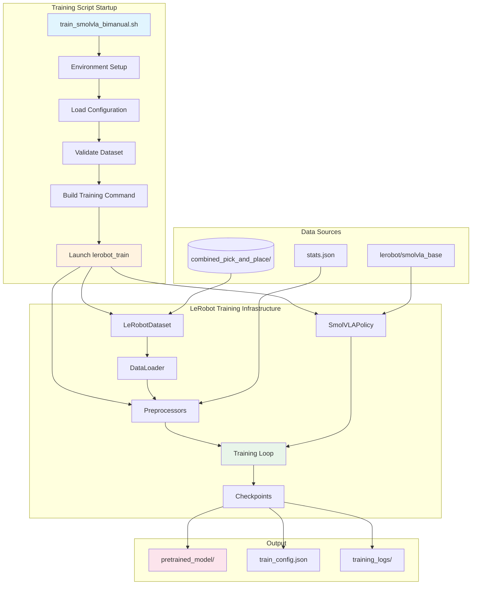
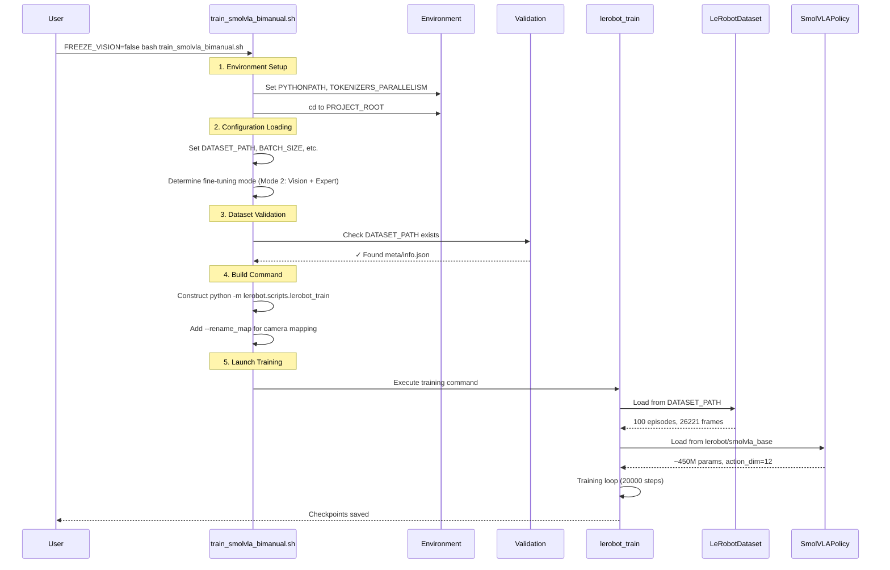
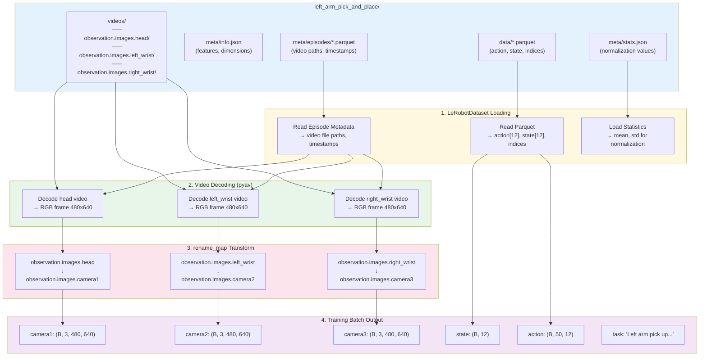
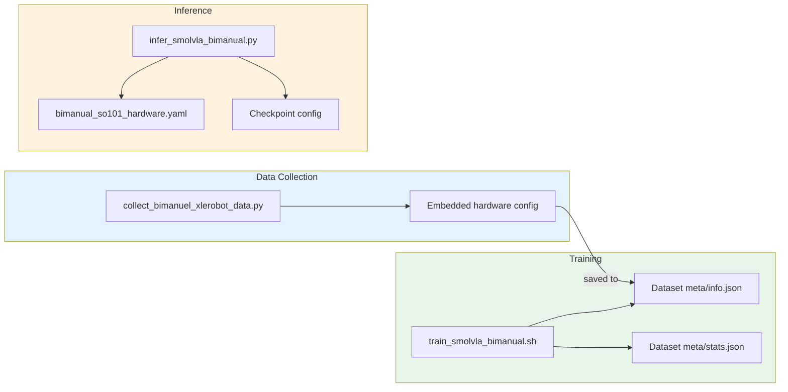
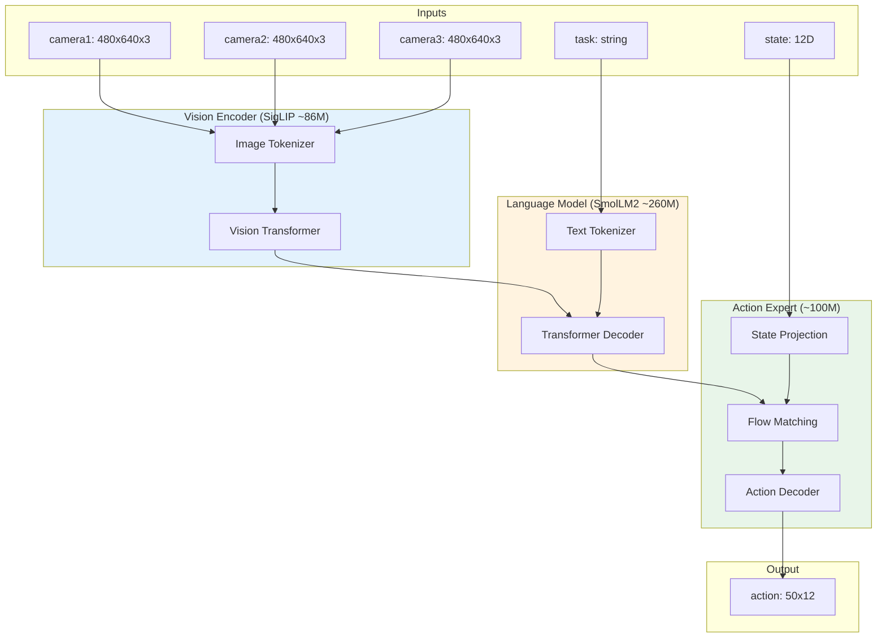

# SmolVLA Bimanual Training Pipeline Documentation

This document details how the bimanual SmolVLA training script orchestrates different components to run a training process.

## Table of Contents
- [Overview](#overview)
- [Architecture Diagram](#architecture-diagram)
- [Startup Sequence](#startup-sequence)
- [Data Flow](#data-flow)
- [Component Details](#component-details)
- [Configuration Examples](#configuration-examples)
- [Verification Results](#verification-results)

---

## Overview

The bimanual SmolVLA training pipeline transforms a pre-trained Vision-Language-Action model to work with a dual-arm robot setup. The key challenge is adapting a model that expects generic inputs to work with our specific bimanual configuration.

**Key Transformations:**
- 3 cameras (head, left_wrist, right_wrist) → SmolVLA's (camera1, camera2, camera3)
- 12D action space (6 left + 6 right) as flat vector
- Task-conditioned learning: "Left arm..." vs "Right arm..."

---

## Architecture Diagram



---

## Startup Sequence



---

## Data Flow

### Dataset Loading Flow



**Key Points:**
1. **Parquet files** contain action/state data (numerical), NOT images
2. **Episode metadata** contains video file paths and timestamps for decoding
3. **Video decoder** (pyav) extracts frames from ALL 3 cameras independently
4. **rename_map** transforms camera key names AFTER decoding (head→camera1, etc.)
5. **Final batch** has SmolVLA-compatible key names (camera1, camera2, camera3)

### Action Space Mapping

```mermaid
flowchart TB
    subgraph Input["Dataset Action (12D)"]
        I0["[0] left_shoulder_pan"]
        I1["[1] left_shoulder_lift"]
        I2["[2] left_elbow_flex"]
        I3["[3] left_wrist_flex"]
        I4["[4] left_wrist_roll"]
        I5["[5] left_gripper"]
        I6["[6] right_shoulder_pan"]
        I7["[7] right_shoulder_lift"]
        I8["[8] right_elbow_flex"]
        I9["[9] right_wrist_flex"]
        I10["[10] right_wrist_roll"]
        I11["[11] right_gripper"]
    end

    subgraph Model["SmolVLA Model"]
        M1["Flow Matching<br/>Denoiser"]
        M2["Action Expert<br/>(~100M params)"]
    end

    subgraph Output["Predicted Action (12D)"]
        O0["[0] left_shoulder_pan"]
        O1["[1] left_shoulder_lift"]
        O2["[2] left_elbow_flex"]
        O3["[3] left_wrist_flex"]
        O4["[4] left_wrist_roll"]
        O5["[5] left_gripper"]
        O6["[6] right_shoulder_pan"]
        O7["[7] right_shoulder_lift"]
        O8["[8] right_elbow_flex"]
        O9["[9] right_wrist_flex"]
        O10["[10] right_wrist_roll"]
        O11["[11] right_gripper"]
    end

    Input --> M1
    M1 --> M2
    M2 --> Output

    style Input fill:#ffebee
    style Model fill:#e8eaf6
    style Output fill:#e8f5e9
```



---

## Configuration Files: When and Where Used



| Stage | Config File | Purpose |
|-------|-------------|---------|
| **Data Collection** | Script-embedded config | Robot ports, camera indices during recording |
| **Training** | `dataset/meta/info.json` | Feature dimensions, camera names |
| **Training** | `dataset/meta/stats.json` | Normalization (mean, std, min, max) |
| **Inference** | `bimanual_so101_hardware.yaml` | Robot ports, camera indices for real-time control |
| **Inference** | `checkpoint/config.json` | Model architecture from training |

**Important:** `bimanual_so101_hardware.yaml` is **NOT used during training**. Training only reads from the dataset's metadata.

---

## Component Details

### 1. Training Script Configuration

```bash
# Key environment variables set by train_smolvla_bimanual.sh
DATASET_PATH="${PROJECT_ROOT}/datasets_bimanuel/bimanual/combined_pick_and_place"
DATASET_NAME="combined_pick_and_place"
PRETRAINED_MODEL="lerobot/smolvla_base"

# Fine-tuning configuration (Mode 2: Vision + Expert)
FREEZE_VISION="false"           # Unfreeze SigLIP vision encoder
TRAIN_EXPERT_ONLY="true"        # Train only vision + action expert
GRADIENT_CHECKPOINTING="true"   # Memory efficiency

# Architecture
CHUNK_SIZE="50"                 # Action chunk size
N_ACTION_STEPS="50"             # Steps to execute per prediction
NUM_STEPS="10"                  # Flow matching denoising steps

# Training hyperparameters
BATCH_SIZE="32"
MAX_STEPS="20000"
LEARNING_RATE="1e-4"
```

### 2. Dataset Structure

```
combined_pick_and_place/
├── data/
│   └── chunk-000/
│       └── file-000.parquet          # 26,221 frames (merged)
│           ├── action: float32[12]
│           ├── observation.state: float32[12]
│           ├── episode_index: int64   # 0-49: left arm, 50-99: right arm
│           ├── task_index: int64      # 0: left arm, 1: right arm
│           └── ...
├── meta/
│   ├── info.json                      # Dataset metadata
│   ├── stats.json                     # Normalization statistics
│   ├── tasks.parquet                  # Task descriptions
│   │   ├── [0] "Left arm pick up the tissue packet..."
│   │   └── [1] "Right arm pick up the tissue packet..."
│   └── episodes/
│       └── chunk-000/file-000.parquet # Episode metadata with video indices
└── videos/
    ├── observation.images.head/
    │   └── chunk-000/
    │       ├── file-000.mp4 ... file-004.mp4  # Left arm videos
    │       └── file-005.mp4 ... file-009.mp4  # Right arm videos (symlinked)
    ├── observation.images.left_wrist/
    └── observation.images.right_wrist/
```

> **Note:** The merged dataset combines `left_arm_pick_and_place` (50 episodes) and `right_arm_pick_and_place` (50 episodes) into 100 total episodes. Videos from the right arm dataset are symlinked with offset file indices.

### 3. Camera Rename Mapping

The training script applies `--rename_map` to transform dataset camera names to SmolVLA's expected names:

| Dataset Key | SmolVLA Key | Purpose |
|-------------|-------------|---------|
| `observation.images.head` | `observation.images.camera1` | Third-person view |
| `observation.images.left_wrist` | `observation.images.camera2` | Left arm egocentric |
| `observation.images.right_wrist` | `observation.images.camera3` | Right arm egocentric |

### 4. Statistics Normalization

```json
// From stats.json - used for input/output normalization
{
  "action": {
    "mean": [1.58, -57.40, 59.91, 57.13, -3.58, 9.41,   // left arm
             -3.66, -64.04, 67.57, 54.50, -0.65, 7.46],  // right arm
    "std": [...],
    "min": [...],
    "max": [...]
  },
  "observation.state": {
    "mean": [...],  // 12 values
    "std": [...]
  }
}
```

### 5. Model Architecture (SmolVLA)



---

## Configuration Examples

### Example: Dataset info.json

```json
{
  "codebase_version": "v3.0",
  "robot_type": "bi_so101_follower",
  "total_episodes": 100,
  "total_frames": 26221,
  "total_tasks": 2,
  "fps": 30,
  "features": {
    "action": {
      "dtype": "float32",
      "shape": [12],
      "names": [
        "left_shoulder_pan.pos", "left_shoulder_lift.pos", "left_elbow_flex.pos",
        "left_wrist_flex.pos", "left_wrist_roll.pos", "left_gripper.pos",
        "right_shoulder_pan.pos", "right_shoulder_lift.pos", "right_elbow_flex.pos",
        "right_wrist_flex.pos", "right_wrist_roll.pos", "right_gripper.pos"
      ]
    },
    "observation.state": {
      "dtype": "float32",
      "shape": [12]
    },
    "observation.images.head": {
      "dtype": "video",
      "shape": [480, 640, 3]
    }
  }
}
```

### Example: Sample Training Batch

```python
# What a training batch looks like after preprocessing
batch = {
    # Images: (B=32, C=3, H=480, W=640)
    "observation.images.camera1": tensor[32, 3, 480, 640],  # head
    "observation.images.camera2": tensor[32, 3, 480, 640],  # left_wrist
    "observation.images.camera3": tensor[32, 3, 480, 640],  # right_wrist

    # State: (B=32, D=12)
    "observation.state": tensor[
        [-4.3, -99.4, 99.9, 50.7, -1.5, 0.7,    # left arm
         -2.0, -99.6, 99.5, 51.3, 3.3, 0.3],    # right arm
        ...  # 32 samples
    ],

    # Action chunks: (B=32, T=50, D=12)
    "action": tensor[32, 50, 12],

    # Task strings
    "task": [
        "Left arm pick up the tissue packet and place it on the plate",
        "Right arm pick up the tissue packet and place it on the plate",
        ...
    ]
}
```

---

## Verification Results

### Runtime Loading Test (`test_dataset_loading.py`)

This test catches critical issues that would cause training to fail:
- **Tasks.parquet format** - Verifies task string is DataFrame index (not column)
- **Task field type** - Verifies `sample['task']` returns STRING (not int)
- **Stats completeness** - Verifies all features have normalization stats

```
======================================================================
RUNTIME DATASET LOADING TEST
======================================================================
Dataset: datasets_bimanuel/bimanual/combined_pick_and_place
Merged dataset: True

Tasks found: 2
  [0] Left arm pick up the tissue packet and place it on the plate
  [1] Right arm pick up the tissue packet and place it on the plate

Verifying tasks.parquet format...
✓ Format correct: 2 tasks with strings as index

Verifying stats.json completeness...
✓ All required stats present (action, state, images)

Loading dataset with pyav backend (same as training)...
✓ Loaded 26221 frames

SAMPLE DATA (first 3 frames):
--- Frame 0 (Left Arm Episode) ---
action: shape=torch.Size([12]), dtype=torch.float32
  left arm  [0:6]:  [-4.3, -99.4, 99.9, 50.7, -1.5, 0.7]
  right arm [6:12]: [-2.0, -99.6, 99.5, 51.3, 3.3, 0.3]
head -> camera1: shape=torch.Size([3, 480, 640])
left_wrist -> camera2: shape=torch.Size([3, 480, 640])
right_wrist -> camera3: shape=torch.Size([3, 480, 640])
task_index: 0 -> "Left arm pick up the tissue packet..."
episode_index: 0

--- Frame 13739 (Right Arm Episode) ---
action: shape=torch.Size([12])
  left arm  [0:6]:  [0.4, -99.5, 99.9, 51.2, -1.6, 0.3]
  right arm [6:12]: [-6.1, -99.6, 98.3, 54.8, -0.6, 3.5]
task_index: 1 -> "Right arm pick up the tissue packet..."
episode_index: 50

SUMMARY:
✓ Action dimension: 12 (correct for bimanual)
✓ State dimension: 12 (correct for bimanual)
✓ observation.images.head: (3, 480, 640)
✓ observation.images.left_wrist: (3, 480, 640)
✓ observation.images.right_wrist: (3, 480, 640)
✓ Task field is STRING: "Left arm pick up the tissue packet..."
✓ Task index 0 maps correctly
✓ Tasks.parquet format correct (task string as index)
✓ Stats complete for training (action, state, images)

--- Merged Dataset Verification ---
✓ Two tasks found (left arm + right arm)
✓ Task 0 is left arm: "Left arm pick up the tissue packet..."
✓ Task 1 is right arm: "Right arm pick up the tissue packet..."
✓ Left arm video loads (mean=0.573)
✓ Right arm video loads (mean=0.579)
✓ Task indices correct: left=0, right=1
✓ ALL CHECKS PASSED - Dataset ready for training!
```

### Static Verification (`verify_bimanual_training_config.py`)

```
Key Checks Passed:
  ✓ Robot type: bi_so101_follower
  ✓ Total episodes: 100 (50 left + 50 right)
  ✓ Total frames: 26221
  ✓ Total tasks: 2
  ✓ Action dimension: 12 (correct for bimanual)
  ✓ Action motor names match expected bimanual format
  ✓ State dimension: 12 (correct for bimanual)
  ✓ Camera 'head' present in dataset
  ✓ Camera 'left_wrist' present in dataset
  ✓ Camera 'right_wrist' present in dataset
  ✓ Camera mapping: head->camera1, left_wrist->camera2, right_wrist->camera3
  ✓ Task 0: "Left arm..." keyword present
  ✓ Task 1: "Right arm..." keyword present
  ✓ Left arm port exists: /dev/ttyACM3
  ✓ Right arm port exists: /dev/ttyACM2
  ✓ Camera devices exist: /dev/video4, /dev/video6, /dev/video8
```

---

## Training Command Reference

```bash
# Full training command generated by the script
python -m lerobot.scripts.lerobot_train \
    --dataset.repo_id=combined_pick_and_place \
    --dataset.root=/path/to/datasets_bimanuel/bimanual/combined_pick_and_place \
    --dataset.video_backend=pyav \
    --policy.path=lerobot/smolvla_base \
    --policy.device=cuda \
    --policy.chunk_size=50 \
    --policy.n_action_steps=50 \
    --policy.num_steps=10 \
    --policy.freeze_vision_encoder=false \
    --policy.train_expert_only=true \
    --policy.train_state_proj=true \
    --policy.gradient_checkpointing=true \
    --policy.optimizer_lr=1e-4 \
    --policy.optimizer_weight_decay=1e-10 \
    --policy.optimizer_grad_clip_norm=10.0 \
    --policy.scheduler_warmup_steps=1000 \
    --policy.scheduler_decay_steps=20000 \
    --policy.scheduler_decay_lr=2.5e-6 \
    --batch_size=32 \
    --steps=20000 \
    --save_freq=2000 \
    --log_freq=100 \
    --num_workers=4 \
    --output_dir=outputs/smolvla_bimanual_TIMESTAMP \
    --job_name=smolvla_bimanual \
    --wandb.enable=false \
    --rename_map='{"observation.images.head":"observation.images.camera1","observation.images.left_wrist":"observation.images.camera2","observation.images.right_wrist":"observation.images.camera3"}'
```

---

## Files Reference

| File | Purpose |
|------|---------|
| `train_smolvla_bimanual.sh` | Main training script |
| `bimanual_so101_hardware.yaml` | Hardware configuration for inference |
| `verify_bimanual_training_config.py` | Pre-training verification |
| `merge_bimanual_datasets.py` | Dataset merging utility |
| `infer_smolvla_bimanual.py` | Inference script |

---

## Troubleshooting

### Common Issues

1. **Dataset not found**: Check `DATASET_PATH` points to correct location
2. **Camera mapping fails**: Ensure dataset has `observation.images.head/left_wrist/right_wrist`
3. **Action dimension mismatch**: Dataset must have 12D actions for bimanual
4. **OOM errors**: Reduce `BATCH_SIZE` or enable `GRADIENT_CHECKPOINTING=true`

### Critical Errors

#### `ValueError: Task cannot be None`

**Cause:** Wrong format in `meta/tasks.parquet`. The task string must be the DataFrame INDEX, not a column.

**Wrong format (causes error):**
```
Index: [0, 1]
Columns: ['task', 'task_index']
    task                                    task_index
0   "Left arm pick up..."                   0
1   "Right arm pick up..."                  1
```

**Correct format:**
```
Index: ["Left arm pick up...", "Right arm pick up..."]
Columns: ['task_index']
task                                        task_index
"Left arm pick up..."                       0
"Right arm pick up..."                      1
```

**Why this happens:** The SmolVLA tokenizer expects `sample['task']` to be a string (the language prompt). LeRobotDataset looks up the task string using the DataFrame index. If the index is numeric instead of the task string, the lookup fails and returns None.

**Fix:** When creating merged datasets, save tasks.parquet with task strings as index:
```python
tasks_df = pd.DataFrame(
    {'task_index': [0, 1]},
    index=['Left arm pick up...', 'Right arm pick up...']
)
tasks_df.to_parquet(output_path / "meta" / "tasks.parquet")
```

#### `KeyError: 'observation.images.head'` in stats

**Cause:** Missing image statistics in `meta/stats.json`. The merge script must copy image stats from source datasets.

**Why this happens:** Video/image features aren't stored in parquet files (only metadata), so computing stats from parquet files misses them. The merge script must explicitly copy image stats from source datasets.

**Fix:** In merge script, copy image stats for video-type features:
```python
first_stats = load_dataset_stats(dataset_paths[0])
for feature_name, feature_info in info["features"].items():
    if feature_info["dtype"] == "video" and feature_name in first_stats:
        merged_stats[feature_name] = first_stats[feature_name]
```

### Verification Commands

```bash
# Run runtime loading test (same as training)
python jdocs/scripts/bimanual/test_dataset_loading.py

# Run static verification (check all config files)
python jdocs/scripts/bimanual/verify_bimanual_training_config.py --show-samples

# Check dataset structure
cat datasets_bimanuel/bimanual/combined_pick_and_place/meta/info.json | python -m json.tool

# Verify camera devices
v4l2-ctl --list-devices
```
